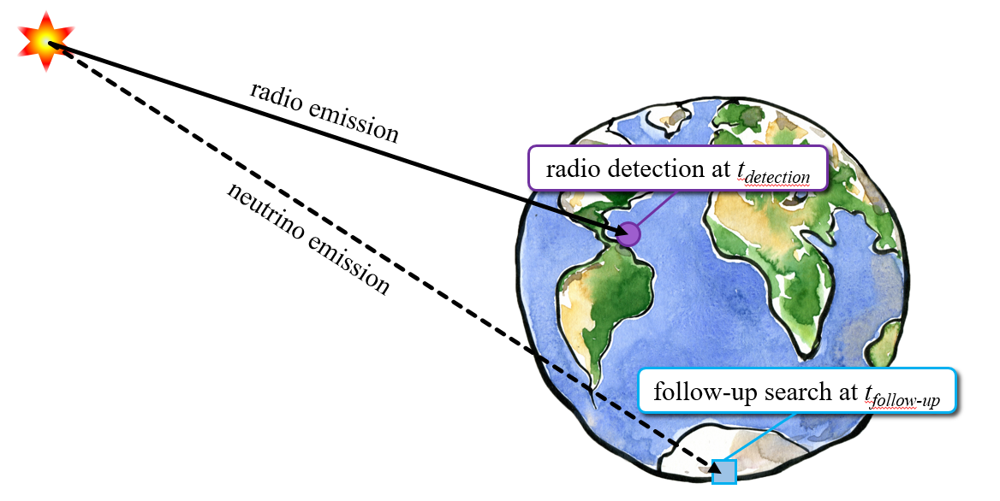
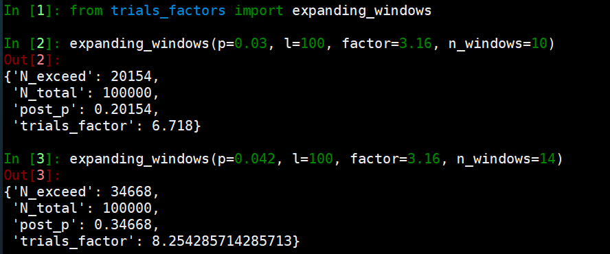

# analysis-tools

This folder is for software tools that were written to solve specific problems in my analyses but may be applied to a broader set of analyses.

## Topocentering

For a transient correlation analysis at timescales less than 1 second, we need to account for the non-negligible distance difference from the source to Observatory A and to Observatory B. For example, assume a telescope at the North Pole detected an astrophysical event at time t0 and declination +90. In an IceCube follow-up search, if the hypothesis is that the electromagnetic and neutrino emissions were simultaneous, the time of maximum temporal correlation is instead t0 + 42 ms: the neutrinos will take an additional 42 ms to travel through the Earth and trigger the detector.

* topocentering.py calculates the correction value given the event coordinates, time at and coordinates of observatory of initial detection, and coordinates of follow-up observatory.

## Trials factors

For some model independent transient searches, we construct on-time windows centered on the time of source detection which expand to search many timescales. We then return the most significant p-value observed among the time windows, but a trials factor is incurred on the p-value for N windows searched. Since the time windows share observed data, the correction is not the trivial P=1-(1-p)^N. The toy Monte Carlo script calculates this by simulating new observed events at each expansion over many realizations.

### Example: Post-trials correction from expanding search

In the Level-2 MuonFilter FRB analysis, the max-burst search was performed in 10 time windows, expanding from 0.0316 seconds out to 1000 seconds by sqrt(10). The most significant time-window returned a pre-trial p-value of 0.03. The code shows that the probability of observing a p-value as significant as 0.03 in the 10 expanding time windows is p_(post-trials) = 0.20.

